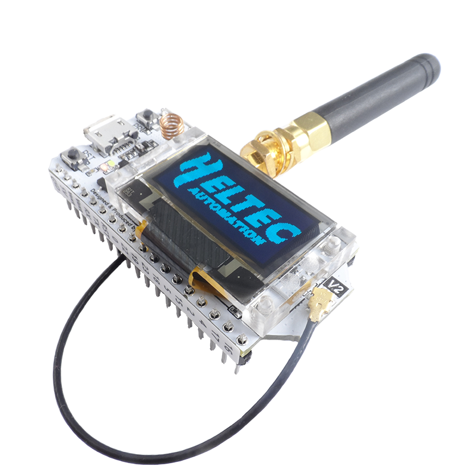
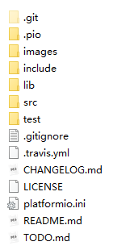
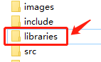
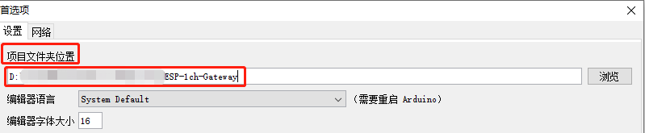
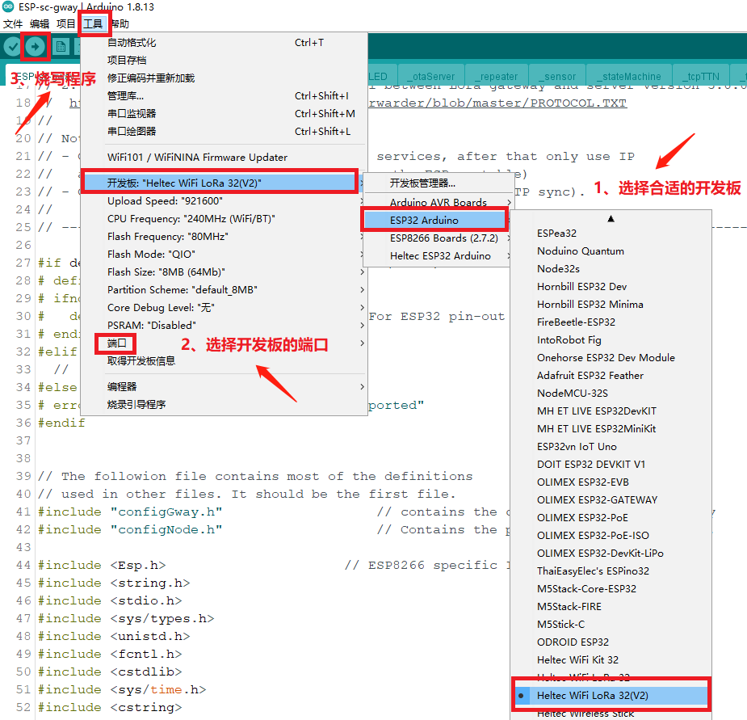
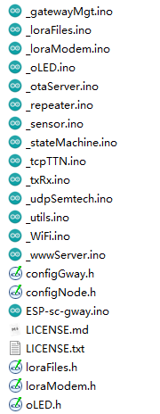
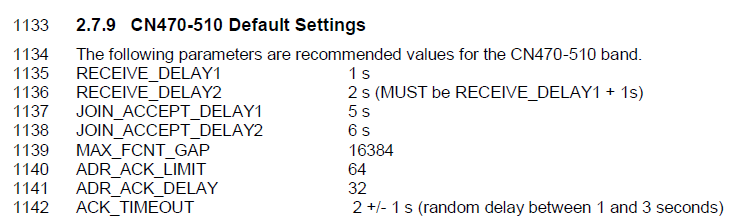
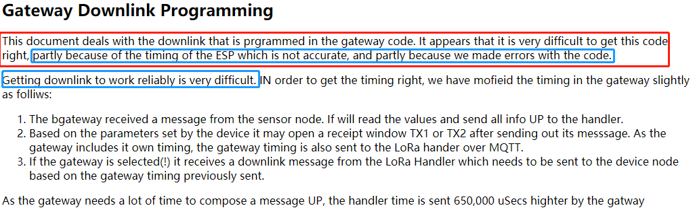
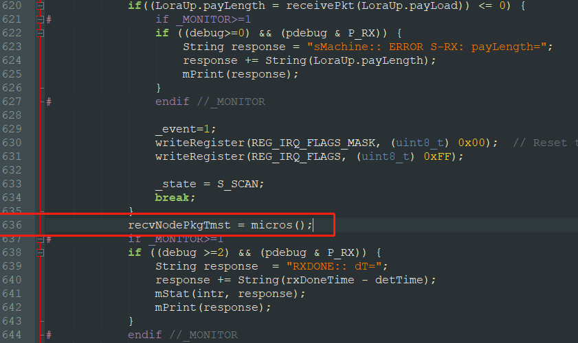

# ESP LoRaWAN单信道网关源码修改版

该项目的源地址在 https://github.com/things4u/ESP-1ch-Gateway ，项目当前最新版本是6.2.5。

**我的这份代码是修改过的，针对CN470频段**，也对作者源代码出现的一些问题做出了修改。更多详细资料请参考作者开源项目文档。

### 1、硬件准备

笔者使用的硬件是 **Heltec WiFi LoRa 32 (V2)**开发板，该开发板在某宝上的价格在85块左右。**Heltec WiFi LoRa 32 (V2)**开发板的详细资料可见官网：https://heltec.org/project/wifi-lora-32/。



该开发板集成了ESP32、sx1278和一块0.9寸的OLED。前面说到，ESP-1ch-Gateway项目里使用的是sx1276芯片，但我们的开发板上使用的是sx1278。其实这两款芯片的管脚虽然有所不同，但操作是一样的，sx1276和sx1278的区别可参考 [SX1262与SX1278、SX1276对比分析以及选型指南](https://blog.csdn.net/weibo1230123/article/details/83446305)。

### 2、开发环境

ESP-1ch-Gateway 推荐使用Arduino IDE开发，所以要事先下载安装好Arduino IDE。除此之外还需要安装ESP32的开发环境。基于Arduino IDE搭建ESP32的开发环境可参考该文 [使用Arduino开发ESP32（01）：开发环境搭建](https://blog.csdn.net/Naisu_kun/article/details/84958561)，这个过程可能需要翻墙。

在搭建好开发环境之后，下载项目的源码，解压，源码目录如下：



我们只需要关注其中的src和lib目录。其中lib目录是该项目依赖的一些库，src 为项目的源代码。有了些之后，为了方便开发，这里将lib目录名称修改为 **libraries** ：



然后在Arduino中的**文件->首选项**中做如下设置：



**填写的目录是src和libraries所在的目录**。

有了这些之后，用Arduino IDE打开src/ESP-sc-gway.ino，该文件中包含单信道网关的主程序。然后将开发板插入电脑USB接口，在Arduino IDE中做如下设置：



程序编译烧写成功便说明开发环境搭建完成了，此时的程序是不能正常工作的，因为还缺少一些必要的配置和修改。

### 3、配置选项

打开src目录，src目录结构如下：



其中大部分需要修改的配置都在configGway.h和configNode.h中，关于这两个文件里的具体详细配置信息可参考这两篇文章：

[Single Channel LoRaWAN Gateway](https://github.com/things4u/ESP-1ch-Gateway/blob/master/README.md) 和 [1-channel Gateway Configuration](http://things4u.github.io/Projects/SingleChannelGateway/UserGuide/3_Configuration.html)。当然这些配置在源代码中也有非常详细的说明，只是配置项太多，很多其实是不需要改动的，接下来我会重点介绍需要关注的那些配置项目，并给出我的配置方案。

#### （1）configNode.h中的配置

configNode.h文件里的配置是将开发板用作LoRa节点，但是我们的目的是构建网关，所以里面的大部分配置其实都用不到，这个文件中我们需要关注的配置只有：

```c++
 wpas wpa[] = {
    { "yourSSID", "yourPassword" },
    { "Your2SSID", "your2Password" }
 };
```

由于网关需要联网，所以需要设置连接热点的名称和密码。我这里将配置**修改为**：

```c++
 wpas wpa[] = {
    { "DaGuLion", "abc360abc" },
    { "Your2SSID", "your2Password" }
 };
```

有了这个，网关便能联网了。除此之外，还有一些网关对外信息的设置，当然这些不是必要的：

```c++
// Gateway Ident definitions. Where is the gateway located?
#define _DESCRIPTION "ESP Gateway"			// Name of the gateway
#define _EMAIL "mw12554@hotmail.com"		// Owner
#define _PLATFORM "ESP8266"
#define _LAT 52.237367
#define _LON 5.978654
#define _ALT 14								// Altitude
```

#### （2）configGway.h中的配置

configGway.h中对网关的配置较多，下面将一一介绍。

##### A. 串口打印信息

配置项为：

```c++
#define _DUSB 1
```

该选项可设置为0、1和2。

设置为0则不打印任何信息；**该选项默认为1**，设置该选项可以通过串口调试助手打印网关运行中的一些日志输出；设置为2则会打印更加详细的信息（例如中断）。需要注意的是，这里推荐设置为1，如果设置为2，输出日志过多则会影响网关的运行，**不推荐设置为2**。

##### B. 设置频段

源码中默认频段为：

```c++
#define EU863_870 1
```

我们是中国地区，这里采用CN470频段，将上面配置**修改为**：

```c++
#define CN470_510 1
```

到这里还没有结束，我们**还需要修改loraModem.h**中相关内容来支持这个频段中的一些频点。该文件中有如下定义：

```c++
#elif defined(CN470_510)
 // China plan for TTN frequencies
 vector freqs [] = {
   { 486300000, 125, 7, 12, 486300000, 125, 7, 12},                        // 486.3 - SF7BW125 to SF12BW125
   { 486500000, 125, 7, 12, 486500000, 125, 7, 12},                        // 486.5 - SF7BW125 to SF12BW125
   { 486700000, 125, 7, 12, 486700000, 125, 7, 12},                        // 486.7 - SF7BW125 to SF12BW125
   { 486900000, 125, 7, 12, 486900000, 125, 7, 12},                        // 486.9 - SF7BW125 to SF12BW125
   { 487100000, 125, 7, 12, 487100000, 125, 7, 12},                        // 487.1 - SF7BW125 to SF12BW125
   { 487300000, 125, 7, 12, 487300000, 125, 7, 12},                        // 487.3 - SF7BW125 to SF12BW125
   { 487500000, 125, 7, 12, 487500000, 125, 7, 12},                        // 487.5 - SF7BW125 to SF12BW125
   { 487700000, 125, 7, 12, 487700000, 125, 7, 12}                         // 487.7 - SF7BW125 to SF12BW125
 };
```

该数组中的每一行中前四项表示上行频点设置，后四项表示下行频点设置，该结构体定义如下：

```c++
struct vector {
	// Upstream messages
	uint32_t upFreq;							// 4 bytes
	uint16_t upBW;								// 2 bytes
	uint8_t  upLo;								// 1 bytes
	uint8_t  upHi;								// 1 bytes
	// Downstream messages
	uint32_t dwnFreq;							// 4 bytes Unsigned ubt Frequency
	uint16_t dwnBW;								// 2 bytes BW Specification
	uint8_t  dwnLo;								// 1 bytes Spreading Factor
	uint8_t  dwnHi;								// 1 bytes
};
```

根据中国地区的《LoRaWAN 频点规范》的规范，**默认设置是不正确的**，所以**需要自行修改上下行频点**，自定自己使用的频点范围。我的**频点范围修改如下**：

```c++
 #elif defined(CN470_510)
 // China plan for TTN frequencies
 vector freqs [] = {
   { 484700000, 125, 7, 12, 505100000, 125, 7, 12},      // 484.7 - SF7BW125 to SF12BW125
   { 484900000, 125, 7, 12, 505300000, 125, 7, 12},      // 484.9 - SF7BW125 to SF12BW125
   { 485100000, 125, 7, 12, 505500000, 125, 7, 12},      // 485.1 - SF7BW125 to SF12BW125
   { 485300000, 125, 7, 12, 505700000, 125, 7, 12},      // 485.3 - SF7BW125 to SF12BW125
   { 485500000, 125, 7, 12, 505900000, 125, 7, 12},      // 485.5 - SF7BW125 to SF12BW125
   { 485700000, 125, 7, 12, 506100000, 125, 7, 12},      // 485.7 - SF7BW125 to SF12BW125
   { 485900000, 125, 7, 12, 506300000, 125, 7, 12},       // 485.9 - SF7BW125 to SF12BW125
   { 486100000, 125, 7, 12, 506500000, 125, 7, 12}      // 486.1 - SF7BW125 to SF12BW125
 };
```

##### C. 工作模式

默认是CLASS A模式，**无需修改**：

```c++
#define _CLASS "A"
```

该网关不支持CLASS B模式，至于CLASS C模式，我没用过。

##### D. 扩频因子

默认设置为SF9：

```c++
#define _SPREADING SF9
```

当然也可以设置为其他的。

##### E. 通道活动监测

如果设置该值为1，那么网关将可以检测到扩频因子在SF7-SF12的信号；如果设置为0，那么只会监听上面_SPREADING设置的信号**（我们这里采用SF9，后面LoRa节点也要配置为SF9）**。默认设置为：

```c++
#define _CAD 1
```

这里只使用SF9，所以**设置为**：

```c++
#define _CAD 0
```

##### F. 配置硬件管脚

硬件支持的配置如下所示：

```c++
// We support a few pin-out configurations out-of-the-box: HALLARD, COMPRESULT and 
// Heltec/TTGO ESP32.
// If you use one of these, just set the parameter to the right value.
// If your pin definitions are different, update the loraModem.h file to reflect the
// hardware settings.
//	1: HALLARD
//	2: COMRESULT pin out
//	3: ESP32, Wemos pin out (Not used)
//	4: ESP32, Heltec and TTGO pin out (should work for Heltec, 433 and Oled too).
//	5: Other, define your own in loraModem.h (does not include GPS Code)
#if !defined _PIN_OUT
#	define _PIN_OUT 1
#endif
```

我们所使用的开发板是Heltec V2（简称），不是注解中1-4所支持的类型，所以**修改配置如下**：

```
#	define _PIN_OUT 5
```

除此之外，还需要在loraModem.h文件中添加自己开发板的管脚定义，定义的结构体可以参照1-4开发板的设置。如果是使用6.2.5版本的代码，作者已经给我们的Heltec v2开发板做了设置：

```c++
#elif _PIN_OUT==5
// ----------------------------------------------------------------------------
// For ESP32/Heltec Wifi LoRA 32(V2) HTIT-WB32LA board with 0.9" OLED
//
// SCK  == GPIO5/ PIN5
// SS   == GPIO18/PIN18 CS
// MISO == GPIO19/ PIN19
// MOSI == GPIO27/ PIN27
// RST  == GPIO14/ PIN14
struct pins {
	uint8_t dio0=26;		// GPIO26 / Dio0 used for one frequency and one SF
	uint8_t dio1=35;		// GPIO35 / Used for CAD, may or not be shared with DIO0
	uint8_t dio2=34;		// GPIO34 / Used for frequency hopping, don't care
	uint8_t ss=18;			// GPIO18 / Dx. Select pin connected to GPIO18
	uint8_t rst=14;			// GPIO0 / D3. Reset pin not used	
} pins;
#define SCK 5				// Check
#define MISO 19				// Check
#define MOSI 27				// Check
#define RST 14				// Check
#define SS 18
```

也就是一些管脚映射，这个参照原理图可以得出。**这里保留默认设置**，但如果是自己DIY的板子，这里要填写自定义板子的管脚映射。

##### G. 严苛单信道模式

由于我们这里是单信道网关，所以**默认设置**是1，**无需修改**：

```c++
#	define _STRICT_1CH 1
```

如果之前设置了_CAN=1，那么可将该配置设置为0。

##### H. 使能OLED

该网关支持使用OLED，而我们的Heltec v2开发板也配有0.9寸OLED，**所以采用默认配置，使能OLED**：

```c++
// Define if Oled Display is connected to I2C bus. Note that defining an Oled display does not
// impact performance negatively, certainly if no Oled is connected. Wrong Oled will not show
// sensible results on the Oled display
// _OLED==0;	No Oled display connected
// _OLED==1;	0.9" Oled Screen based on SSD1306
// _OLED==2;	1.3" Oled screens for Wemos, 128x64 SH1106
#if !defined _OLED
#	define _OLED 1
#endif
```

该项如果设置为0，OLED将不工作，即使OLED已经连接到开发板。

##### I. NTP设置

网关需要获取时间，所以必须配置NTP服务器，默认配置如下：

```c++
#define NTP_TIMESERVER "nl.pool.ntp.org"       // Country and region specific
#define NTP_TIMEZONES  2                       // How far is our Timezone from UTC (excl daylight saving/summer time)
#define SECS_IN_HOUR   3600
#define NTP_INTR 0                             // Do NTP processing with interrupts or in loop();
```

这里**修改为**：

```c++
#define NTP_TIMESERVER "ntp.ntsc.ac.cn"	// Country and region specific
#define NTP_TIMEZONES	0					// How far is our Timezone from UTC (excl daylight saving/summer time)
#define SECS_IN_HOUR	3600
#define NTP_INTR 0							// Do NTP processing with interrupts or in loop();
```

修改为中国的时区。

##### J. TTN服务器

默认TTN服务器为：

```
#define _TTNSERVER "router.eu.thethings.network"
#define _TTNPORT 1700
```

我们使用腾讯云物联网平台，所以**修改为**：

```
#define _TTNSERVER "loragw.things.qcloud.com"
#define _TTNPORT 1700
```

到此，单信道网关必要的配置便完成了。更多更详细的配置选项请参考该节开始介绍的两个链接和源码注解，这里只给出了必要的。

#### （3）其他必要配置

在 _loraFiles.ino 中：

```c++
void initConfig(struct espGwayConfig *c)
{
	(*c).ch = 0;
	(*c).sf = _SPREADING;
	(*c).debug = 1;						// debug level is 1
	(*c).pdebug =  P_GUI | P_MAIN;// P_GUI | P_MAIN | P_TX | P_RX;
	(*c).cad = _CAD;
	(*c).hop = false;
	(*c).seen = true;					// Seen interface is ON
	(*c).expert = false;				// Expert interface is OFF
	(*c).monitor = true;				// Monitoring is ON
	(*c).trusted = 1;
	(*c).txDelay = 0;					// First Value without saving is 0;
	(*c).dusbStat = true;
	...//后续无关代码忽略，具体详见源码文件
} // initConfig()
```

在这个配置中定义了网关初始化运行时的配置，下面将具体介绍几个相关的重要配置。

* **默认工作频点**

```c++
(*c).ch = 0;
```

定义了网关初始化使用的频点，前面我们在loraModem.h文件中修改了CN470的频点：

```c++
 vector freqs [] = {
   { 484700000, 125, 7, 12, 505100000, 125, 7, 12},      // 484.7 - SF7BW125 to SF12BW125
   { 484900000, 125, 7, 12, 505300000, 125, 7, 12},      // 484.9 - SF7BW125 to SF12BW125
   { 485100000, 125, 7, 12, 505500000, 125, 7, 12},      // 485.1 - SF7BW125 to SF12BW125
   { 485300000, 125, 7, 12, 505700000, 125, 7, 12},      // 485.3 - SF7BW125 to SF12BW125
   { 485500000, 125, 7, 12, 505900000, 125, 7, 12},      // 485.5 - SF7BW125 to SF12BW125
   { 485700000, 125, 7, 12, 506100000, 125, 7, 12},      // 485.7 - SF7BW125 to SF12BW125
   { 485900000, 125, 7, 12, 506300000, 125, 7, 12},       // 485.9 - SF7BW125 to SF12BW125
   { 486100000, 125, 7, 12, 506500000, 125, 7, 12}      // 486.1 - SF7BW125 to SF12BW125
 };
```

该选项默认时使用的是484.7，但我这里使用的是486.1，所以**将其赋值为7**。

* **debug级别**

```
(*c).debug = 1;
```

默认设置为Level1，推荐保留默认设置，日志级别太高打印信息过多将导致系统运行不稳定。

* **细粒度debug日志输出**

```
(*c).pdebug =  P_GUI | P_MAIN;
```

默认只是将level1级别debug日志在串口或者web面板（该web控制面板在最后会介绍，在web控制面版中可以修改这些配置）中显示。如果还设置了P_TX 和 P_RX，日志将会输出一些上行和下行的细节，尤其对于下行的严苛的时间控制，输出这些日志会导致数据接收超时，下行工作不正常，**所以强烈推荐保留默认设置，不开启P_TX 和 P_RX选项**。

最后修改的部分如下所示，这里**只设置了通道值**，其余保留默认设置：

```c++
(*c).ch = 7;
(*c).sf = _SPREADING;
(*c).debug = 1;						// debug level is 1
(*c).pdebug = P_GUI | P_MAIN;//  P_MAIN | P_TX | P_RX;
```

### 4、修改源码

按照作者的文档，硬件搭建完成后，完成上面的配置之后烧写程序后网关便可运行了。然而实际不是那么理想，笔者在做完所有配置后还遇到了三个较大的问题，有些问题也在该项目中的Issue中被反复提起，但作者也没能给出让人满意的解决。在Iot小能手的支持和鼓励下，我宛若一匹陷入敌阵的独狼，欲将bug消灭。奥力给干了兄弟们！！！

#### （1）服务器收到了上行数据，但不发送下行数据

节点join网络时，网关发送上行数据给服务器，服务器也显示收到了上行数据，然而就到此为止了，服务器没有发送下行数据给网关。当时刚刚接触这套代码，对于这个问题也觉得非常诡异，在小伙伴们的帮助下，发现上行数据中的频点有问题，我这里采用的是486.1的频点，然而上传数据却为486100006。对的，没有看错，多了个尾巴“6”，这个非常奇怪。于是跟踪定位到了_txRx.ino中：

```c++
ftoa((double)freqs[gwayConfig.ch].upFreq / 1000000, cfreq, 6);
```

这个cfreq便是通过ftoa函数生成的，也就是我们想要的486100000，然后这个值将上传到服务器。然而不幸的是，ftoa函数给我们生成的却是486100006，我们的服务器不支持这个频点，所以也就没有下行数据了。

ftoa函数在_utils.ino中定义，具体内容可参考源码。经测试，发现**该函数存在浮点精度问题**，所以导致了486100006这个结果。鉴于该函数还在其他地方调用，不便修改。于是呢，**在\_utils.ino中新加入一个函数**：

```c++
void ftoa2(float f, char *val, int p) 
{
  int j=1;
  int ival, fval;
  char b[7] = { 0x00, 0x00, 0x00, 0x00, 0x00, 0x00, 0x00 };

  for (int i=0; i< p; i++) { j= j*10; }

  ival = (int) f;                     // Make integer part
//  fval = (int) ((f- ival)*j);               // Make fraction. Has same sign as integer part
  fval = (int)(f * 10);
  fval %= 10;
  fval *= j / 10;
  if (fval<0) fval = -fval;               // So if it is negative make fraction positive again.
                              // sprintf does NOT fit in memory
  if ((f<0) && (ival == 0)) strcat(val, "-");
  strcat(val,itoa(ival,b,10));              // Copy integer part first, base 10, null terminated
  strcat(val,".");                    // Copy decimal point
  itoa(fval,b,10);
  // Copy fraction part base 10
  for (unsigned int i=0; i<(p-strlen(b)); i++) {
    strcat(val,"0");                  // first number of 0 of faction?
  }
  // Fraction can be anything from 0 to 10^p , so can have less digits
  strcat(val,b);
}
```

对的，就是ftoa2，很拙劣的命名，但可以解决上面的问题。同时，将_txRx.ino中的

```c++
ftoa((double)freqs[gwayConfig.ch].upFreq / 1000000, cfreq, 6);
```

**修改为：**

```c++
ftoa2((double)freqs[gwayConfig.ch].upFreq / 1000000, cfreq, 6);
```

这个问题便解决了，服务器将发送下行数据给网关。

#### （2）上发服务器数据中的通道错误

前面讲到，我使用了486.1这个频点，通道为7，然而上行数据中给服务器发送的通道却一直是0，不论怎么修改都是0，这是不对的。于是追踪源码到_txRx.ino中的 buildPacket函数，在该函数中有这么一段：

```c++
buff_index += snprintf((char *)(buff_up + buff_index), 
    TX_BUFF_SIZE-buff_index, 
    "\"chan\":%1u,\"rfch\":%1u,\"freq\":%s,\"stat\":1,\"modu\":\"LORA\"" , 
    0, 0, cfreq);
```

我们可以看到，chan被赋值为0，而非我们设置的channel值，所以**修改代码如下**：

```c++
buff_index += snprintf((char *)(buff_up + buff_index), 
    TX_BUFF_SIZE-buff_index, 
    "\"chan\":%1u,\"rfch\":%1u,\"freq\":%s,\"stat\":1,\"modu\":\"LORA\"" , 
    gwayConfig.ch, 0, cfreq);
```

#### （3）downlink失败

这个问题是该开源项目诟病最多的一个，不论是在V5版本还是V6版本。

从《LoRaWAN 1.0.3 Regional Parameters》中的2.7.9节，我们可以知道节点join过程中有个延时，该延时为5s：



简言之，从节点join开始上发数据到网关到网关下发数据到节点这一过程要控制在5s。

经测试，网关代码这一过程的延时达到了5s + 20-35ms，如果开启了一些日志输出这个延时可以达到60ms，问题就在这里了。绞尽脑汁，万般无奈，于是反复阅读作者的一些资料，在[Gateway Downlink Programming](http://things4u.github.io/Projects/SingleChannelGateway/DeveloperGuide/3_Gateway_Programming/32_Gway_Downlink.html)中发现：



看起来作者也没有很好的解决方法。于是笔者就傻乎乎地认为是ESP32的精度不够，反复测试了delay和micirs这两个和downlink相关的函数。发现这两个函数精度真的没问题，所以只能是认为是作者代码的问题了。终于，在一个阳光明媚的早晨，我发现了问题所在。接下来修改源码。

在configGway.h中的末尾加入：

```c++
int32_t recvNodePkgTmst = 0;
```

在_stateMachine.ino中插入这句：

```c++
recvNodePkgTmst = micros();
```

插入的位置为，插入到代码的636行：



在_txRx.ino中的buildPackage函数中的500行左右有：

```c++
LoraUp->tmst = (uint32_t) micros()+ _RXDELAY1;
```

将这句代码注解，然后加入这句：

```c++
LoraUp->tmst = recvNodePkgTmst + _RXDELAY1;
//LoraUp->tmst = (uint32_t) micros()+ _RXDELAY1;
```

这样就舒服了。是的，问题在于网关上报给服务器的时间有问题，recvNodePkgTmst被赋值的时刻和调用micros()函数构建Loraup->tmst之间是有时间误差的，downlink失败的根源就在这里。所以作者为了弥补这个误差，在延时的时候加入了一个补偿值，但这样没有根本解决问题，而且网关运作不够流畅，每次都要去调整这个值。该补偿值在_loraModem.ino中的loraWait函数中用到，该补偿值为**gwayConfig.txDelay**，默认初始化为0。下面截取了延时相关的关键代码：

```c++
void loraWait(struct LoraDown *LoraDown)
{
    .... // 忽略
	int32_t delayTmst = (int32_t)(LoraDown->tmst - micros()) + gwayConfig.txDelay;
												// delayTmst based on txDelay and spreading factor
	.... // 忽略
	// For larger delay times we use delay() since that is for > 15ms
	// This is the most efficient way.
	while (delayTmst > 15000) {
		delay(15);										// ms delay including yield, slightly shorter
		//delayMicroseconds(15000);						// ms delay including yield, slightly shorter
		delayTmst -= 15000;
	}
	// The remaining wait time is less than 15000 uSecs
	// but more than 1000 mSecs (see above)
	// therefore we use delayMicroseconds() to wait
	delayMicroseconds(delayTmst);
	gwayConfig.waitOk++;
	return;
}
```

到这里，网关能正常接受join了。


**想了解更多有关物联网的行业动态和技术干货，请打开微信搜索关注“腾讯无线与物联网”公众号。**